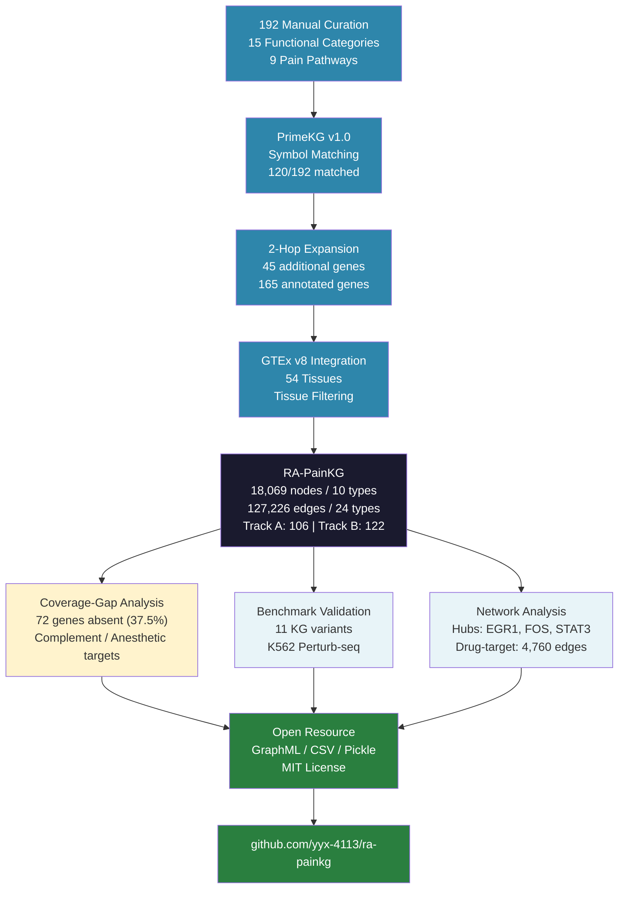

```mermaid
flowchart TD
    A["192 Manual Curation
15 Functional Categories
9 Pain Pathways"] --> B["PrimeKG v1.0
Symbol Matching
120/192 matched"]
    B --> C["2-Hop Expansion
45 additional genes
165 annotated genes"]
    C --> D["GTEx v8 Integration
54 Tissues
Tissue Filtering"]
    D --> E["RA-PainKG
18,069 nodes / 10 types
127,226 edges / 24 types
Track A: 106 | Track B: 122"]
    
    E --> F1["Coverage-Gap Analysis
72 genes absent (37.5%)
Complement / Anesthetic targets"]
    E --> F2["Benchmark Validation
11 KG variants
K562 Perturb-seq"]
    E --> F3["Network Analysis
Hubs: EGR1, FOS, STAT3
Drug-target: 4,760 edges"]
    
    F1 --> G["Open Resource
GraphML / CSV / Pickle
MIT License"]
    F2 --> G
    F3 --> G
    
    G --> H["github.com/yyx-4113/ra-painkg"]
    
    style A fill:#2E86AB,color:#fff
    style B fill:#2E86AB,color:#fff
    style C fill:#2E86AB,color:#fff
    style D fill:#2E86AB,color:#fff
    style E fill:#1a1a2e,color:#fff
    style F1 fill:#FFF3CD,color:#333
    style F2 fill:#E8F4F8,color:#333
    style F3 fill:#E8F4F8,color:#333
    style G fill:#2A7F3F,color:#fff
    style H fill:#2A7F3F,color:#fff
```
