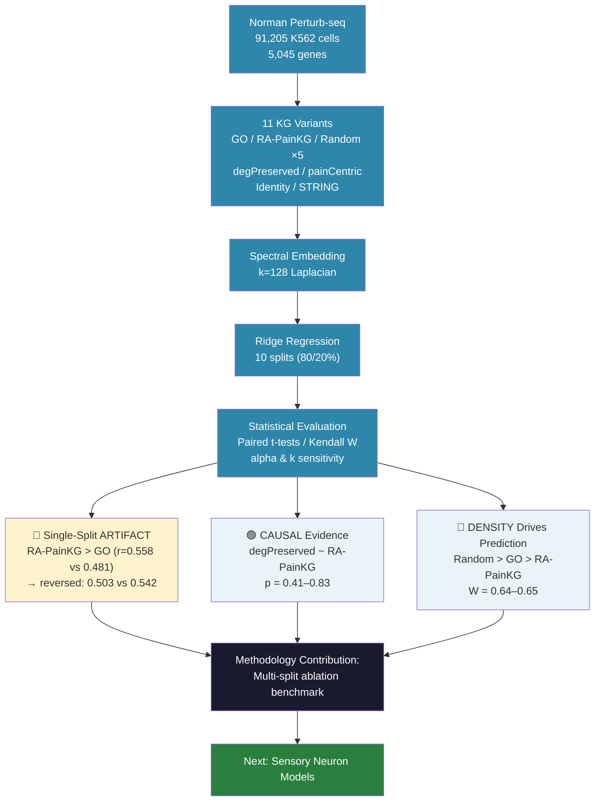

```mermaid
flowchart TD
    A["Norman Perturb-seq<br/>91,205 K562 cells<br/>5,045 genes"] --> B["11 KG Variants<br/>GO / RA-PainKG / Random ×5<br/>degPreserved / painCentric<br/>Identity / STRING"]
    B --> C["Spectral Embedding<br/>k=128 Laplacian"]
    C --> D["Ridge Regression<br/>10 splits (80/20%)"]
    D --> E["Statistical Evaluation<br/>Paired t-tests / Kendall W<br/>alpha & k sensitivity"]
    
    E --> F1["🔴 Single-Split ARTIFACT<br/>RA-PainKG > GO (r=0.558 vs 0.481)<br/>→ reversed: 0.503 vs 0.542"]
    E --> F2["🟢 CAUSAL Evidence<br/>degPreserved ~ RA-PainKG<br/>p = 0.41–0.83"]
    E --> F3["🔵 DENSITY Drives Prediction<br/>Random > GO > RA-PainKG<br/>W = 0.64–0.65"]
    
    F1 --> G["Methodology Contribution:<br/>Multi-split ablation benchmark"]
    F2 --> G
    F3 --> G
    
    G --> H["Next: Sensory Neuron Models"]
    
    style A fill:#2E86AB,color:#fff
    style B fill:#2E86AB,color:#fff
    style C fill:#2E86AB,color:#fff
    style D fill:#2E86AB,color:#fff
    style E fill:#2E86AB,color:#fff
    style F1 fill:#FFF3CD,color:#333
    style F2 fill:#E8F4F8,color:#333
    style F3 fill:#E8F4F8,color:#333
    style G fill:#1a1a2e,color:#fff
    style H fill:#2A7F3F,color:#fff
```
